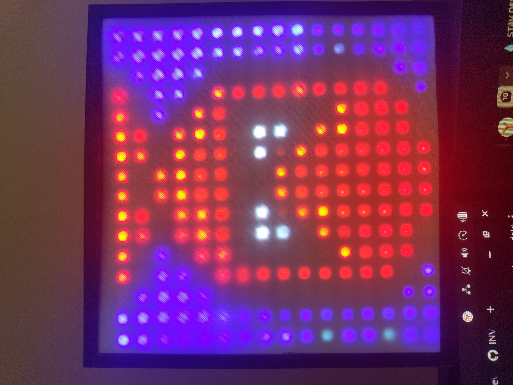

# NeoMatrix 16x16 – ESPHome & Home Assistant Animations

A collection of custom 16x16 RGB LED matrix animations, 3D printable enclosure models, and an automated configuration builder tailored for **ESPHome** and **Home Assistant**.



## ⚠️ Why is `matrix.yaml` so huge and messy?

ESPHome requires byte-array LED animation frames to be defined directly within the main device configuration. Because storing dozens of frame-by-frame matrix animations produces **thousands of lines of raw hex/array data**, the resulting `matrix.yaml` is intentionally auto-generated and virtually unreadable for humans. 

**Do not edit `matrix.yaml` manually!** Instead, modify individual animations in the `animations/` folder and rebuild the configuration using the Python script.

---

## 📁 Repository Structure

* **`animations/`** – Source animation files (JSON / C++ headers) for the matrix.
* **`3d_models/`** – STL/CAD files for the 3D-printed enclosure.
* **`images/`** – Project photos and setup showcase (`00.jpg`).
* **`matrix.yaml`** – Final auto-generated YAML configuration ready for ESPHome.
* **`generate_yaml.py`** – Python script that compiles all animations into `matrix.yaml`.

---

## 🚀 Quick Start

### 1. Requirements
* Python 3.x
* ESPHome (integrated with Home Assistant)

### 2. Generate the ESPHome YAML
To add, remove, or update animations, place your files into `animations/` and rebuild `matrix.yaml`:

```bash
python generate_yaml.py
